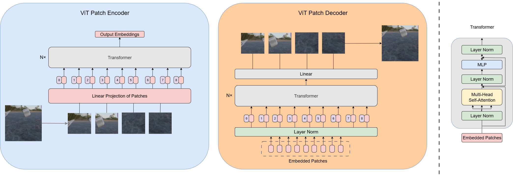
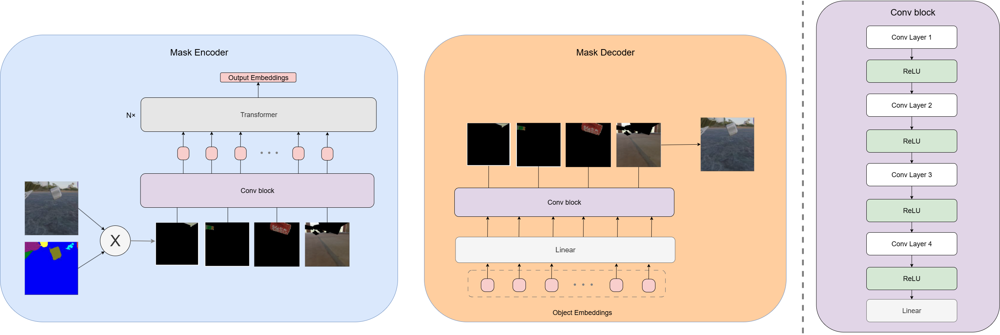
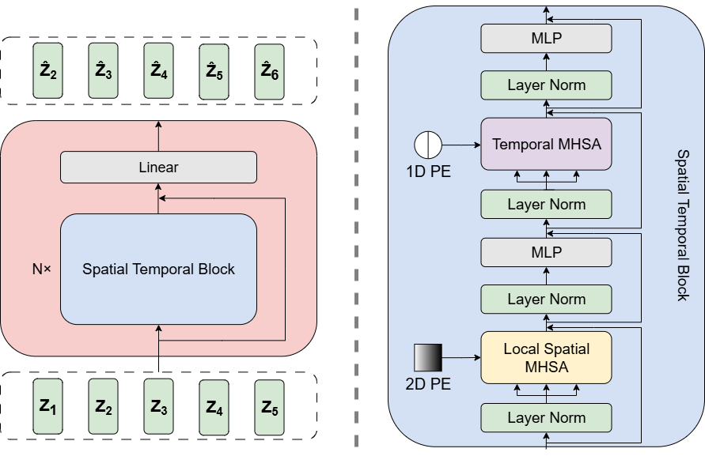

# Evaluating Image Representations for Video Prediction

Transformer-based video frame prediction on **MOVi-C**, comparing patch-based RGB representations with object-centric mask-based representations.

---

## Overview

The project studies how different image representations affect future-frame prediction.

The pipeline consists of two stages:

1. an **autoencoder** compresses video frames into latent representations;
2. a **Transformer predictor** models their temporal dynamics and predicts future representations, which are decoded back into RGB frames.

We compare:

- **Patch-based representation** — ViT-style patch encoder/decoder;
- **Object-centric representation** — masked object slots with Transformer refinement;
- **Auto-regressive (AR)** and **Teacher Forcing (TF)** predictor training.

---

## Architecture

### Patch-based Autoencoder

Frames are split into patches, encoded as Transformer tokens and reconstructed with a ViT-style decoder.

<!-- Architecture figure: Patch-based Autoencoder -->

  

### Object-centric Autoencoder

Instance masks isolate individual objects. Each object is encoded into a slot representation, refined with self-attention and decoded back into the full frame.

<!-- Architecture figure: Object-centric Autoencoder -->

  

### Spatial-Temporal Predictor

The predictor receives embeddings from five seed frames and applies spatial and temporal attention to predict future latent representations.

<!-- Architecture figure: Predictor -->

  

---

## Dataset

Experiments are performed on **MOVi-C**, a synthetic object-centric video dataset containing moving 3D-scanned objects on realistic backgrounds.

For this project, RGB frames are used by both approaches, while instance segmentation masks are additionally used by the object-centric model.

## Results

### Model Naming

The predictor models follow the naming convention:

**Pred {Representation} {Training Regime}**

where:

- **Obj** — object-centric representation produced by the mask-based autoencoder
- **Patch** — patch-based representation produced by the ViT-style autoencoder
- **AR** — Auto-Regressive training, where previously predicted representations are fed back into the predictor
- **TF** — Teacher Forcing, where ground-truth representations are used as context during training

For the prediction experiments, the best reconstruction model from each representation type was selected:

- **Patch Autoencoder:** embedding dimension `256`
- **Object-centric Autoencoder:** embedding dimension `512`

### Quantitative Results

| Model           |     MSE ↓ |    SSIM ↑ |     PSNR ↑ |   LPIPS ↓ |      FVD ↓ |
| --------------- | --------: | --------: | ---------: | --------: | ---------: |
| **Pred Obj AR** | **0.083** |     0.415 | **19.083** |     0.542 |     79.676 |
| Pred Obj TF     |     0.088 |     0.409 |     18.454 |     0.457 |     68.932 |
| Pred Patch AR   |     0.121 | **0.421** |     16.841 |     0.514 |     73.307 |
| Pred Patch TF   |     0.145 |     0.376 |     15.607 | **0.447** | **63.237** |

Higher values are better for **SSIM** and **PSNR**, while lower values are better for **MSE**, **LPIPS** and **FVD**.

### Main Observations

**Pred Obj AR** achieves the strongest pixel-level reconstruction quality, with the lowest MSE (`0.083`) and the highest PSNR (`19.083 dB`). This indicates that object-centric representations provide useful structural information for predicting individual pixel values and maintaining object appearance during the rollout.

**Pred Patch AR** achieves the highest SSIM (`0.421`). Although its pixel-level error is larger than for the object-centric models, it preserves the overall image structure particularly well.

Teacher Forcing improves the perceptual metrics for both representation types. **Pred Patch TF** achieves the lowest LPIPS (`0.447`) and FVD (`63.237`), indicating the strongest perceptual similarity and video-level realism according to these metrics.

The qualitative results, however, reveal an additional difference between the representations. Object-centric predictors preserve object motion and identity more consistently across longer rollouts. The object masks provide explicit structured cues about individual objects, which help the predictor maintain their location and dynamics.

In the **Obj AR** setting, some objects may gradually disappear from the predicted masks toward the end of long autoregressive rollouts. This effect is reduced with Teacher Forcing, where ground-truth context provides stronger short-term supervision and helps keep object representations localized.

Patch-based predictors preserve the global scene structure, but motion tends to decrease over time. In particular, the Teacher-Forcing model produces strong short-horizon predictions but gradually converges toward smoother and more uniform frames during longer rollouts. This behavior is consistent with pixel-wise reconstruction losses encouraging averaged predictions when motion becomes uncertain.

Overall, the experiments show a trade-off between different objectives:

- **Object-centric representations** provide better pixel-level accuracy and more stable object dynamics.
- **Patch-based representations** achieve stronger structural or perceptual metrics in several settings.
- **Auto-Regressive training** better exposes the model to its own prediction errors during rollout.
- **Teacher Forcing** produces stronger short-term perceptual quality but may suffer from motion degradation during long open-loop prediction.

---

## Qualitative Results

Qualitative results of video prediction are available in the `results/` folder

Interactive demos of training/evaluation are available in the notebooks:

- `test_reconstruction.ipynb` — reconstruction demo for the autoencoders (bothe patch and mask)
- `test.ipynb` — predictor training demo (Obj/RGB × TF/AR), Patch Autoencoder training
- 
### Auto-Regressive Rollout

<table>
  <tr>
    <th align="center">Ground Truth</th>
    <th align="center">Patch Representation</th>
    <th align="center">Object-Centric Representation</th>
  </tr>
  <tr>
    <td align="center">
      
    </td>
    <td align="center">
      
    </td>
    <td align="center">
      
    </td>
  </tr>
</table>

### Teacher-Forcing Rollout

<table>
  <tr>
    <th align="center">Ground Truth</th>
    <th align="center">Patch Representation</th>
    <th align="center">Object-Centric Representation</th>
  </tr>
  <tr>
    <td align="center">
      
    </td>
    <td align="center">
      
    </td>
    <td align="center">
      
    </td>
  </tr>
</table>

---

## Key Findings

Object-centric representations provide a stronger inductive bias for tracking objects and maintaining motion. RGB-based models remain competitive on perceptual metrics, but their dynamics tend to weaken during longer rollouts.

The experiments also show that pixel accuracy, structural similarity and perceptual video quality do not necessarily favor the same model.

---

